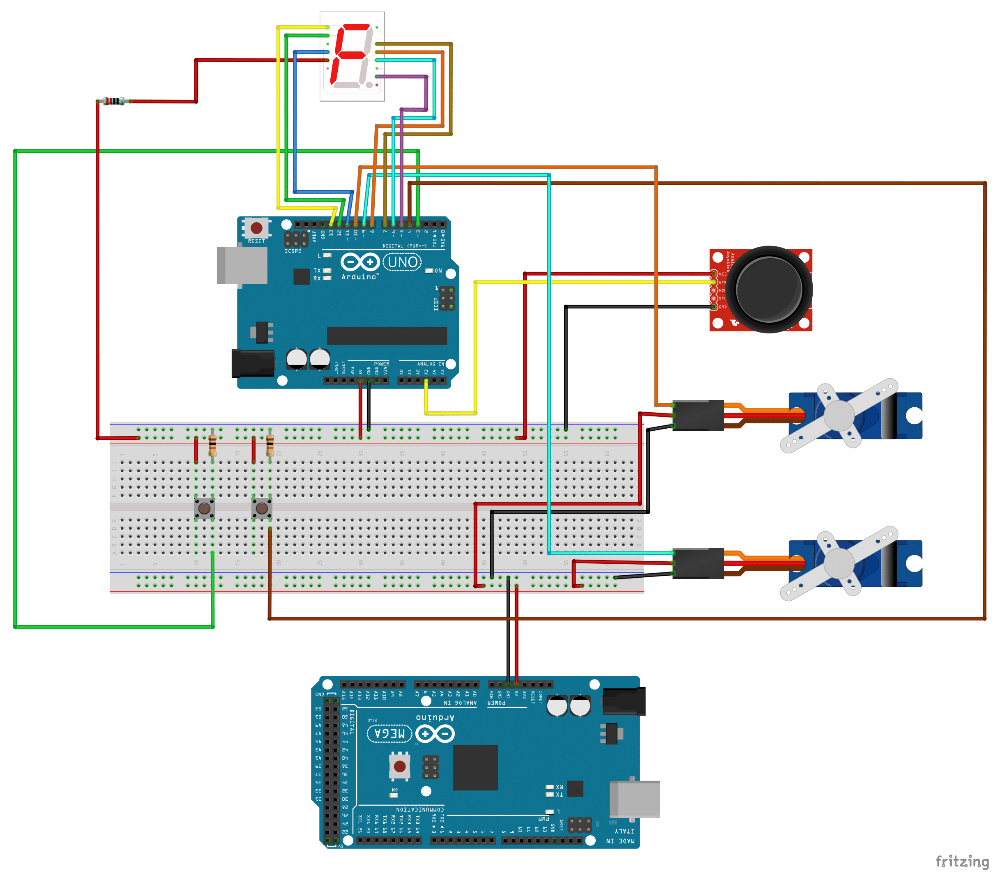
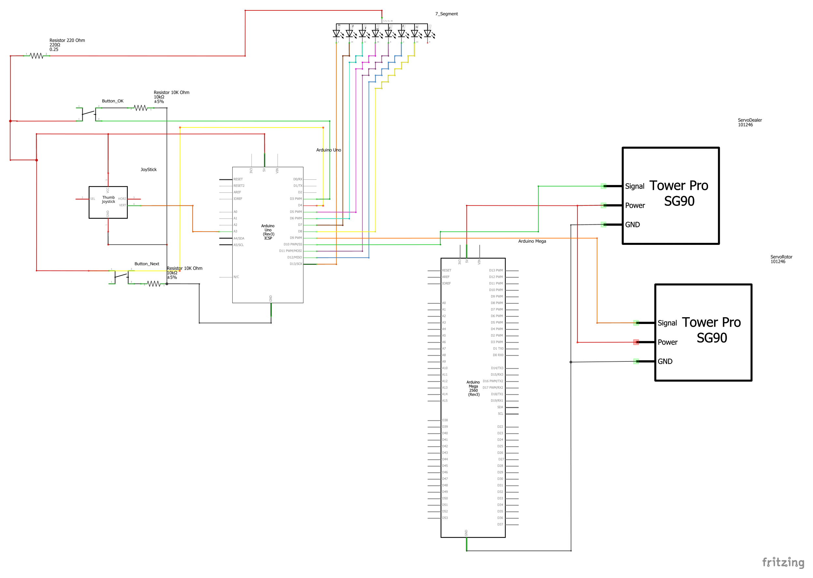

# Automatic Cards Dealer

This is an automatic card dealer. You can set up to 5 players, each receiving up to 5 cards, and you also have the option to set the position of each player. This project was implemented on an ATMega328P, as close to bare metal as possible, without using high-level libraries or functions.

## Table of Contents
- [Components Used](#components-used)
- [Circuit Diagram](#circuit-diagram)
- [Schematic View](#schematic-view)
- [Installation](#installation)
- [Usage](#usage)
- [License](#license)
- [Credits](#credits)

## Components Used
- 1x Arduino UNO
- 1x Arduino MEGA
- 1x SG90 Servo 180°
- 1x MG90S Continuous Servo
- 1x XY Joystick
- 2x Push buttons
- 2x 10K ohm resistors
- 1x 220 ohm resistor
- 1x 1-digit 7-segment display (I used 5161BS, common anode)
- 3x Male-to-female jumper wires
- 22x Male-to-male jumper wires

## Circuit Diagram

## Schematic View

## Installation
1. **Assemble the components**: Connect the components following the diagram and `video.mp4`. You may need to improvise the card holder and MG90S slot if you don't have a 3D printer.
2. **Upload the Arduino UNO code**: Use the Arduino IDE to upload the provided sketch (`src/CardDealer/CardDealer.ino`) to your Arduino UNO.
3. **Power up the Arduino MEGA**: Power the Arduino MEGA via a serial communication cable or a 9V battery.
4. **Install Python and its modules**:
   - pySerial
   - PyQt5
5. **Connect Arduino UNO to the PC**
6. **Run the Python program**: Execute the script `src/CardDealerInterface/CardDealer_Interface.py`

## Usage
1. **Set up the number of players and cards**: Using the joystick and the button, adjust the number of players and the number of cards to be dealt at the beginning of the game.
2. **Configure player positions**: Use the joystick to set the position of each player.
3. **Start the game**: Use the buttons 'K' and 'N' to play. 'K' means the current player needs a card, which will be dealt, and then the game moves to the next player. 'N' means the current player does not need a card and directly moves to the next player.

For reference, you can watch `video.mp4`.

## License
This project is licensed under the [MIT License](LICENSE).

## Credits
- **Author**: Felix-Marian STOENOIU
- **Email**: Stoenoiu.Felix1@gmail.com
- **GitHub**: [My GitHub profile](https://github.com/FelixMarian)
